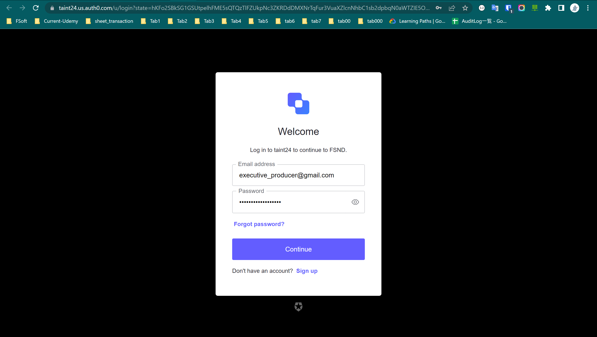

# Casting Agency Specifications


## Motivation for the project

I have learned a lot of interesting things in this course and I have ready for final capstone project.

## URL location for the hosted API
URL: https://fsnd-final-capstone.herokuapp.com/

## Deploy local
### Installing Dependencies

#### Python 3.7

Follow instructions to install the latest version of python for your platform in the [python docs](https://docs.python.org/3/using/unix.html#getting-and-installing-the-latest-version-of-python)

#### Virtual Environment

We recommend working within a virtual environment whenever using Python for projects. This keeps your dependencies for each project separate and organized. Instructions for setting up a virtual environment for your platform can be found in the [python docs](https://packaging.python.org/guides/installing-using-pip-and-virtual-environments/)

#### PIP Dependencies

Once you have your virtual environment setup and running, install dependencies by running:

```bash
pip install -r requirements.txt
```

This will install all of the required packages we selected within the `requirements.txt` file.

##### Key Dependencies

- [Flask](http://flask.pocoo.org/) is a lightweight backend microservices framework. Flask is required to handle requests and responses.

- [SQLAlchemy](https://www.sqlalchemy.org/) and [Flask-SQLAlchemy](https://flask-sqlalchemy.palletsprojects.com/en/2.x/) are libraries to handle the lightweight sqlite database. Since we want you to focus on auth, we handle the heavy lift for you in `./src/database/models.py`.

- [jose](https://python-jose.readthedocs.io/en/latest/) JavaScript Object Signing and Encryption for JWTs. Useful for encoding, decoding, and verifying JWTS.

## Running the server

From within the `./src` directory first ensure you are working using your created virtual environment.

Setup Auth service to run local, run:

```bash
source setup.sh;
```

Each time you open a new terminal session, run:

```bash
export FLASK_APP=api.py;
```

To run the server, execute:

```bash
flask run --reload
```

The `--reload` flag will detect file changes and restart the server automatically.

## Role

### We have 3 roles in the system

1. Casting Assistant: Can view actors and movies
2. Casting Director:
- All permissions a Casting Assistant has and…
- Add or delete an actor from the database
- Modify actors or movies
3. Executive Producer:
- All permissions a Casting Director has and…
- Add or delete a movie from the database


## Deployment
I deploy the app in Heroku system.

The URL: https://fsnd-final-capstone.herokuapp.com/

When you open the above URL, the web shows you a link to log in to Auth Service. Copy that link and open in new tab:


### Log in to system
This is page of Auth service to log in and get bearer token



Login with account for each role:

- Casting Assistant:

email: `casting_assistant@gmail.com`

password: `aksdbq*^A&$ca14232`

- Casting Director:

email: `casting_director@gmail.com`

password: `aksdbq*^A&$ca14232`

- Executive Producer:

email: `executive_producer@gmail.com`

password: `aksdbq*^A&$ca14232`


The access_token will show in URL bar, copy this token to add authentication header in each api to verify its


### Log out the system
If you want to check the api with another role, you have to log out and log in to take the new access token,

So in the browser, access https://fsnd-final-capstone.herokuapp.com/logout,

The browser show a link, copy this link and open it in new tab


## API behavior and RBAC controls
The project has 10 apis:
1. `GET '/'`
- For generate log in link to auth service, to login and take access_token
- Request Arguments: None
- Returns: An URL link to log in auth service

---
2. `GET '/logout'` 

- For generate log out link to auth service, to login with other account, other role
- Request Arguments: None
- Returns: An URL link to log out auth service

---
3. `GET /actors`
- RBAC: read:actors, account with role Casting Assistant, Casting Director and Executive Producer
can access this api
- This api to get all actors in system
- Request Arguments: None
- Returns 

```json
{
    "actors": [
        {
            "age": 50,
            "gender": "Man",
            "id": 1,
            "name": "Dwayne Johnson"
        },...
    ],
    "success": true
}
```
---
4. `GET /movies`
- RBAC: read:movies, account with role Casting Assistant, Casting Director and Executive Producer
can access this api
- This api to get all movies in system
- Request Arguments: None
- Returns 

```json
{
    "movies": [
        {
            "id": 1,
            "release_date": "2017-04-14",
            "title": "Fast and furious 8"
        },...
    ],
    "success": true
}
```
---
5. `POST /actors`
- RBAC: add:actors, account with role Casting Director and Executive Producer
can access this api
- This api to add an actor to system
- Request Arguments: 
```json
{
    "name": "Tai", # name of the actor, type string
    "age": 24, # age of the actor, type integer
    "gender": 0 # gender of the actor, type integer, 0 for man, 1 for women
}
```
- Returns 

```json
{
    "actors": {
        "age": 24,
        "gender": "Man",
        "id": 4,
        "name": "Tai"
    },
    "success": true
}
```
---
6. `DELETE /actors/<actor_id>`
- RBAC: delete:actors, account with role Casting Director and Executive Producer
can access this api
- This api to delete an actor to system
- Request Arguments: 
```
actor_id: id of the actor in system
```
- Returns 

```json
{
    "id": <actor_id>,
    "success": true
}
```
---
7. `PATCH /actors/<actor_id>`
- RBAC: update:actors, account with role Casting Director and Executive Producer
can access this api
- This api to update an actor in system
- Request Arguments: 
```
actor_id: id of the actor in system
```
```json
{
    "name": "Actor name",
    "age": 18,
    "gender": 1
}
```

- Returns 

```json
{
    "actor": {
        "age": 18,
        "gender": "Women",
        "id": 2,
        "name": "Actor name"
    },
    "success": true
}
```
---
8. `PATCH /movies/<movie_id>`
- RBAC: update:movies, account with role Casting Director and Executive Producer
can access this api
- This api to update a movie in system
- Request Arguments: 
```
movie_id: id of the movie in system
```
```json
{
    "release_date": "2020-10-01"
}
```

- Returns 

```json
{
    "movie": {
        "id": 1,
        "release_date": "2020-10-01",
        "title": "Fast and furious 8"
    },
    "success": true
}
```
---
9. `POST /movies`
- RBAC: add:movies, account with role Executive Producer
can access this api
- This api to add a movie to system
- Request Arguments: 
```json
{
    "title": "Fast and furious 9", # title of the movie, type string
    "release_date": "2020-10-01", # release_date of the movie, type string, format YYYY-mm-dd
}
```
- Returns 

```json
{
    "movie": {
        "id": 2,
        "release_date": "2020-10-01",
        "title": "Fast and furious 9"
    },
    "success": true
}
```
---
10. `DELETE /movies/<movie_id>`
- RBAC: delete:movies, account with role Executive Producer
can access this api
- This api to delete a movie in system
- Request Arguments: 
```
movie_id: id of the movie in system
```
- Returns 

```json
{
    "id": <movie_id>,
    "success": true
}
```


## Testing

To deploy the tests with unittest library, run

```bash
python .\test_flaskr.py
```

---
To tests demonstrating role-based access control, import file `FSND_capstone.postman_collection.json`
to postman

if the token has expired, log in to auth server to get new access_token

